# Zen Pharma Dev Deployment Handbook

## 1. Purpose and scope

This handbook explains how the Zen Pharma development platform is designed,
built, deployed, validated, operated, and reused. It is both a study guide and an
operator runbook.

The scope is strictly the `dev` environment. Nothing in this guide authorizes a
QA or production deployment. Commands that change cloud or cluster state must be
reviewed before execution.

### Complete project diagram

The attached diagram below shows the entire system from source repositories and
CI/CD through AWS infrastructure, Kubernetes controllers, workloads, secrets, and
the database. Open the image directly when you need to zoom in.

[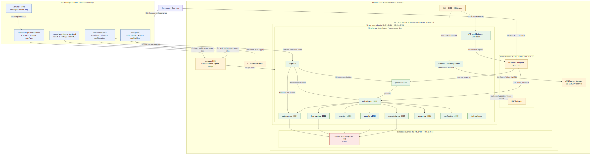](diagrams/zen-pharma-dev-architecture.png)

### Contents

1. Purpose and scope
2. Repository ownership
3. Deployed dev inventory
4. AWS and Kubernetes architecture
5. Workload architecture
6. Identity and secret flow
7. Infrastructure delivery flow
8. Application image delivery flow
9. Bootstrap procedure
10. Validation runbook
11. Troubleshooting decision tree
12. Change and rollback procedures
13. Reuse checklist
14. Known gaps before production
15. Command safety guide
16. Related documents

### Learning objectives

After studying this guide, you should be able to explain:

1. What each repository owns.
2. How Terraform creates the AWS foundation.
3. How GitHub Actions builds and signs application images.
4. How Argo CD deploys Helm releases to EKS.
5. How External Secrets Operator delivers secrets without putting values in Git.
6. How an HTTP request travels from a browser to a microservice and RDS.
7. How to validate, troubleshoot, roll back, and recreate the dev environment.

## 2. Repository ownership

| Repository/folder | Responsibility | Source of truth |
| --- | --- | --- |
| `roland-zen-phama-backend` | Java and Node services, tests, Dockerfiles, image workflows | Application behavior and backend images |
| `roland-zen-phama-frontend` | React UI, Nginx packaging, tests, image workflow | Browser experience and UI image |
| `Zen-Roland_infra` | Terraform, IAM, platform Helm values, architecture and runbooks | AWS infrastructure and platform controllers |
| `zen-gitops` | Shared Helm chart, dev values, Argo CD project and applications | Desired Kubernetes workload state |
| `workflow-intro` | CI/CD learning material and workflow examples | Training only; not a deployment source |

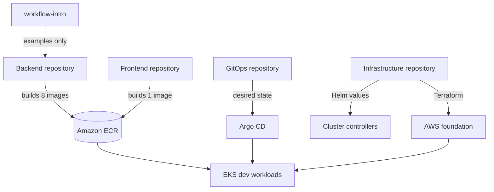

### Ownership rule

Make changes in the repository that owns the resource:

- AWS network, EKS, RDS, ECR, IAM, or Secrets Manager: infrastructure repo.
- Kubernetes image tag, replicas, resources, ingress, or environment values:
  GitOps repo.
- Application endpoint or behavior: backend/frontend repo.
- Never make a lasting production-style change with only `kubectl edit`; Argo CD
  will either reverse it or leave Git different from the cluster.

## 3. Deployed dev inventory

| Layer | Dev implementation |
| --- | --- |
| AWS account | `651706754162` |
| Region | `us-east-1` |
| VPC | `10.0.0.0/16` |
| EKS | `pharma-dev-cluster`, Kubernetes `1.35` |
| Compute | Managed node group, four desired `t3.small` nodes, range 1-5 |
| Database | Private PostgreSQL 17.9 RDS instance |
| Registry | Nine ECR repositories, scan on push, keep last ten images |
| Namespace | `dev` |
| Ingress | Shared internet-facing AWS ALB, HTTP port 80 |
| Delivery | Argo CD with nine dev Applications |
| Secrets | AWS Secrets Manager to Kubernetes through External Secrets Operator |
| Metrics | Metrics Server |

The current ALB DNS name is recorded in `DEV-DEPLOYMENT-RECORD.md`. Treat it as
dynamic: deleting and recreating the ingress can produce a new hostname.

## 4. AWS and Kubernetes architecture

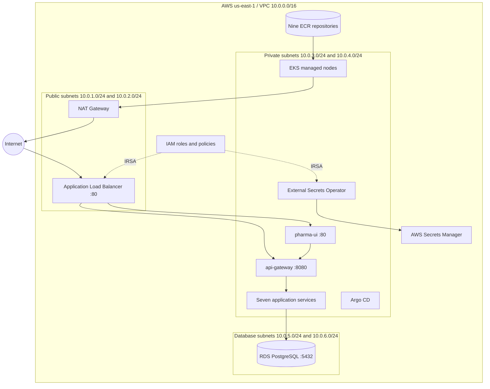

### Network chart

| Zone | CIDRs | Main resources | Exposure |
| --- | --- | --- | --- |
| Public | `10.0.1.0/24`, `10.0.2.0/24` | ALB, NAT path | Internet-routable |
| Private application | `10.0.3.0/24`, `10.0.4.0/24` | EKS nodes and pods | No direct inbound Internet access |
| Private database | `10.0.5.0/24`, `10.0.6.0/24` | RDS | PostgreSQL allowed only from EKS node security group |

The EKS API currently has both public and private endpoints. Restrict the public
endpoint CIDRs or use private administrative access before treating this as a
production baseline.

## 5. Workload architecture

| Workload | Port | Primary purpose | Database/secret dependency |
| --- | ---: | --- | --- |
| `pharma-ui` | 80 | React UI served by Nginx | None directly |
| `api-gateway` | 8080 | Routes API calls and applies gateway filters | JWT configuration |
| `auth-service` | 8081 | Login, registration, JWT creation/validation | PostgreSQL and JWT secret |
| `drug-catalog-service` | 8082 | Drug catalog | PostgreSQL |
| `inventory-service` | 8083 | Inventory | PostgreSQL |
| `supplier-service` | 8084 | Suppliers | PostgreSQL |
| `manufacturing-service` | 8085 | Manufacturing | PostgreSQL |
| `qc-service` | 8086 | Quality control | Verify current profile before reuse |
| `notification-service` | 3000 | Notifications | Verify current chart values before reuse |

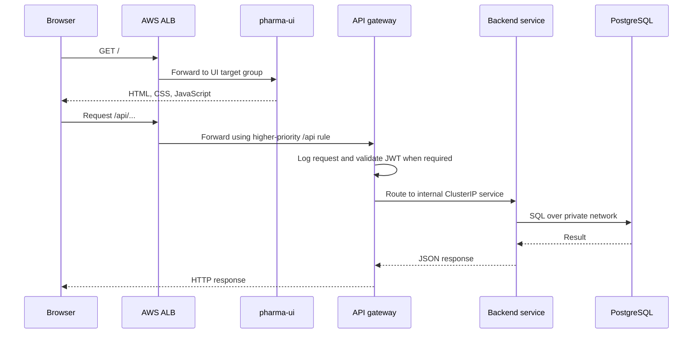

The ingress group order is significant: the API gateway uses order `10`, while
the UI uses order `20`. Lower numbers are evaluated first, ensuring `/api/*` does
not fall through to the UI.

## 6. Identity and secret flow

[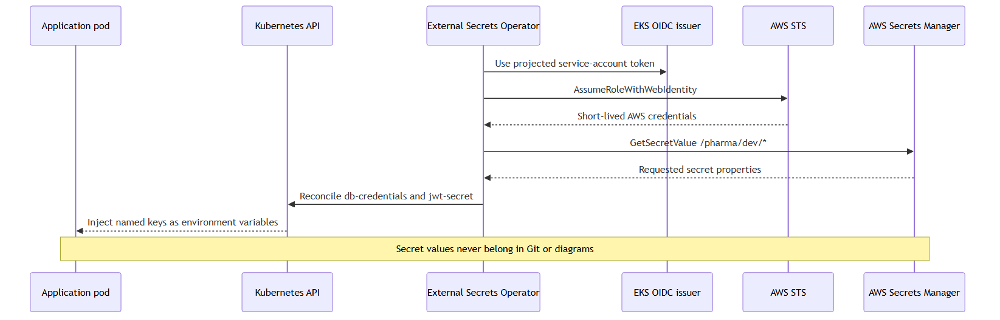](diagrams/secret-flow.png)

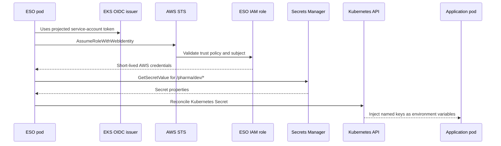

### Secret rules

- Secret values belong in AWS Secrets Manager, never Git.
- GitOps stores only secret names, remote paths, and property mappings.
- Documentation may list key names such as `DB_HOST` and `JWT_SECRET`, but must
  never contain their values.
- Do not print decoded Kubernetes Secrets during normal validation.
- Rotate any credential that appears in a screenshot, chat, shell history, or log.

## 7. Infrastructure delivery flow

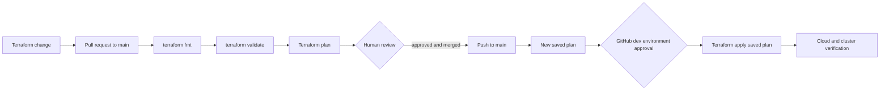

### Current workflow behavior

| Trigger | Result |
| --- | --- |
| Pull request changing `envs/dev/**` or `modules/**` | Format, init, validate, plan |
| Push/merge to `main` on those paths | Plan, then gated dev apply |
| Manual `plan` | Dev plan |
| Manual `apply` | Dev plan and gated apply |
| Manual `destroy` plus typed confirmation | Gated dev destroy |

The workflow currently reads stored `AWS_ACCESS_KEY_ID` and
`AWS_SECRET_ACCESS_KEY` repository secrets. The infrastructure also defines a
GitHub OIDC role. Company-standard hardening should migrate this workflow to OIDC
with `id-token: write` and `role-to-assume`, then delete the long-lived AWS keys.

## 8. Application image delivery flow

[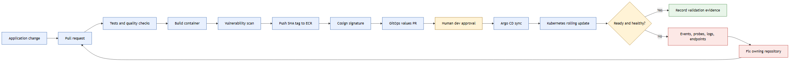](diagrams/delivery-flow.png)

```mermaid
flowchart LR
    CODE[Application commit] --> CI[Tests and quality checks]
    CI --> BUILD[Docker build]
    BUILD --> SCAN[Container vulnerability scan]
    SCAN --> PUSH[Push immutable sha tag to ECR]
    PUSH --> SIGN[Cosign signature]
    SIGN --> VALUES[Update dev GitOps image tag]
    VALUES --> ARGO[Argo CD detects commit]
    ARGO --> ROLL[Rolling deployment]
    ROLL --> HEALTH[Readiness and functional checks]
```

### Deployed image chart

| Image | Dev tag |
| --- | --- |
| API gateway, auth, catalog, inventory, manufacturing, QC, supplier | `sha-b0f17f2` |
| Notification | `sha-71c1e3f` |
| UI | `sha-cf8d8ac` |

Use immutable commit tags or digests for repeatability. Do not deploy `latest`.

## 9. Bootstrap procedure

### 9.1 Prerequisites

Install and authenticate these tools:

```bash
aws --version
terraform version
kubectl version --client
helm version
gh --version
docker --version
```

Confirm identities before changing anything:

```bash
aws sts get-caller-identity
gh auth status
git remote -v
```

Never continue if the AWS account, GitHub organization, repository, branch, or
environment differs from the approved target.

### 9.2 Terraform validation and apply

For normal company use, submit a pull request and let GitHub Actions generate the
plan. For local study and diagnosis:

```bash
cd /d/workingDirectory/Zen-Roland_infra
terraform fmt -check -recursive
terraform -chdir=envs/dev init
terraform -chdir=envs/dev validate
terraform -chdir=envs/dev plan
```

Sensitive variables must be provided through an approved secret mechanism, not
typed into a recorded command or committed `.tfvars` file.

After infrastructure exists, configure `kubectl`:

```bash
aws eks update-kubeconfig \
  --region us-east-1 \
  --name pharma-dev-cluster \
  --alias pharma-dev

kubectl config current-context
kubectl get nodes
```

### 9.3 Install platform controllers

Install in dependency order using the exact values under
`kubernetes/dev/platform-values/`:

1. Metrics Server.
2. AWS Load Balancer Controller.
3. External Secrets Operator.
4. Argo CD.

Use the chart versions recorded in `DEV-DEPLOYMENT-RECORD.md`. Pin versions; do not
silently install whatever is newest.

### 9.4 Bootstrap GitOps

Apply only the dev Argo CD project and applications from the GitOps repository.
Argo CD then owns the workload resources and reconciles the nine Helm releases.

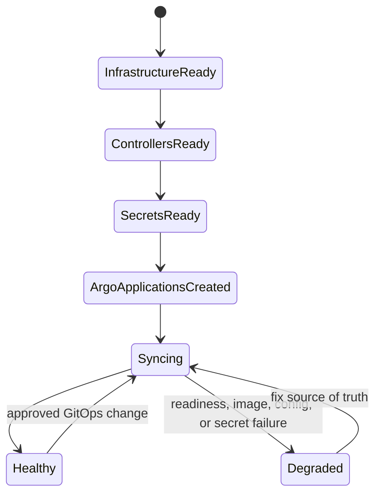

## 10. Validation runbook

Run the checks in this order. Later checks depend on earlier layers.

### Layer 1: AWS and cluster

```bash
aws eks describe-cluster \
  --region us-east-1 \
  --name pharma-dev-cluster \
  --query 'cluster.status'

kubectl get nodes
kubectl top nodes
```

Expected: EKS is `ACTIVE`, nodes are `Ready`, and metrics return values.

### Layer 2: controllers

```bash
kubectl -n kube-system get deployment metrics-server
kubectl -n kube-system get deployment aws-load-balancer-controller
kubectl -n external-secrets get pods
kubectl -n argocd get pods
```

Expected: all desired replicas are available with no crash loops.

### Layer 3: secrets

```bash
kubectl get clustersecretstore aws-secrets-manager
kubectl -n dev get externalsecret
kubectl -n dev get secret db-credentials jwt-secret
```

Expected: store and ExternalSecrets report Ready/SecretSynced. Check names and
status only; do not decode values.

### Layer 4: GitOps and workloads

```bash
kubectl -n argocd get applications.argoproj.io
kubectl -n dev get deployments
kubectl -n dev get pods
kubectl -n dev get endpointslices
```

Expected: nine applications are Synced/Healthy, nine pods are Ready, and endpoint
slices contain ready addresses.

### Layer 5: ingress and browser

```bash
kubectl -n dev get ingress
ALB_HOST=$(kubectl -n dev get ingress pharma-ui \
  -o jsonpath='{.status.loadBalancer.ingress[0].hostname}')
echo "$ALB_HOST"
curl -I "http://$ALB_HOST/"
curl "http://$ALB_HOST/api/auth/health"
```

Expected: both ingresses show the same hostname, UI returns HTTP 200, and auth
health returns a healthy JSON response.

Browser test:

1. Enter the complete `http://` URL. HTTPS is not configured yet.
2. Load the login page.
3. Use an approved dev test account; do not share its password in documentation.
4. Test catalog, inventory, supplier, manufacturing, QC, and notifications.
5. Confirm browser developer tools show no failed API calls.

## 11. Troubleshooting decision tree

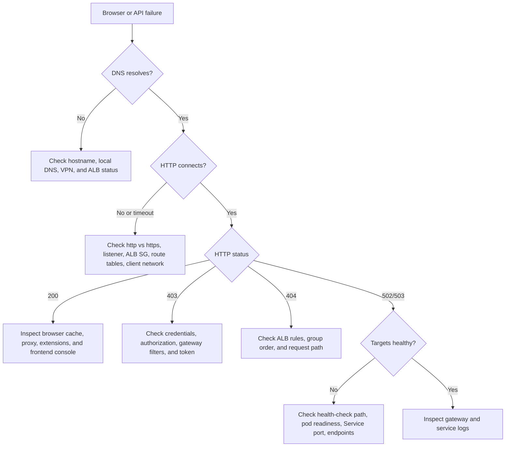

### Browser works on one device only

The ALB is public when its scheme is `internet-facing` and port 80 is allowed from
`0.0.0.0/0`. If one device works and another does not:

1. Type the full `http://` URL; some browsers force HTTPS.
2. Try a private/incognito window.
3. Disable VPN or corporate proxy temporarily.
4. Try a different network, such as a phone hotspot.
5. Check DNS with `nslookup ALB_HOSTNAME`.
6. Record the exact browser error: timeout, DNS failure, 403, or 503 imply
   different causes.

### ALB target is unhealthy

```bash
kubectl -n dev describe ingress api-gateway
kubectl -n dev get pods,endpointslices
kubectl -n dev logs deployment/api-gateway --since=10m
```

The API gateway target group must check `/actuator/health/readiness`, not `/`.
The latter may return a non-success response even when the gateway is healthy.

### ExternalSecret is not Ready

```bash
kubectl get clustersecretstore aws-secrets-manager
kubectl -n dev describe externalsecret db-credentials
kubectl -n external-secrets logs deployment/external-secrets --since=10m
kubectl -n external-secrets get serviceaccount external-secrets -o yaml
```

Check the IRSA role annotation, OIDC trust subject, AWS secret path, property name,
and IAM `GetSecretValue` permission. Never solve this by committing secret values.

### Pod is not Ready

```bash
kubectl -n dev describe pod POD_NAME
kubectl -n dev logs POD_NAME --all-containers --since=10m
kubectl -n dev get events --sort-by=.lastTimestamp
```

Read events from bottom to top. Common causes are image pull errors, missing secret
keys, insufficient resources, failed database connections, and incorrect probe
paths.

### Argo application is OutOfSync or Degraded

```bash
kubectl -n argocd describe application APP_NAME
kubectl -n argocd get application APP_NAME -o yaml
```

Fix the GitOps source and let Argo reconcile. Avoid repeatedly applying local
manifests because that hides the real desired state.

## 12. Change and rollback procedures

### Normal application change

1. Change and test the application repository.
2. Merge only after CI passes.
3. Build, scan, push, and sign the immutable image.
4. Update only the dev image tag in GitOps.
5. Review and merge the GitOps pull request.
6. Watch Argo sync, rollout, readiness, and functional tests.
7. Record the deployed tag and evidence.

### Application rollback

1. Identify the last known-good immutable tag.
2. Revert the GitOps commit or submit a pull request restoring that tag.
3. Merge after review.
4. Watch Argo reconcile and verify all layers again.

Do not rebuild an old source revision under the same tag; rollback must reference
the exact previously tested artifact.

### Infrastructure rollback

Infrastructure rollback is a new reviewed Terraform change, not an automatic
`git revert` followed blindly by apply. Generate a plan, inspect replacements and
data-loss risk, obtain dev approval, apply the saved plan, and validate.

### Emergency containment

If urgent containment is needed, record the incident and coordinate ownership.
Temporary scaling or ingress removal may be used in dev, but immediately reconcile
the intended state in GitOps. Never destroy RDS as a first response.

## 13. Reuse checklist

Use this checklist when recreating dev or adapting the pattern for a new company
environment:

- [ ] Confirm account, region, environment, owners, cost limits, and data class.
- [ ] Create a separate Terraform state key and separate secret paths.
- [ ] Select non-overlapping VPC and subnet CIDRs.
- [ ] Review EKS and RDS versions for supported compatibility.
- [ ] Replace all account IDs, role ARNs, repository URLs, and hostnames.
- [ ] Use OIDC for CI and IRSA for pods; do not create long-lived AWS keys.
- [ ] Restrict public EKS API access.
- [ ] Add HTTPS with ACM, DNS, and HTTP-to-HTTPS redirect.
- [ ] Use least-privilege security groups and IAM policies.
- [ ] Enable log retention, alerts, budgets, backup restore tests, and ownership tags.
- [ ] Pin controller charts and application images.
- [ ] Enforce tests, coverage, vulnerability policy, signature verification, and approvals.
- [ ] Test rollback and recovery before calling the environment ready.
- [ ] Keep QA and production in separate approval boundaries and preferably separate accounts.

## 14. Known gaps before production

| Gap | Dev status | Required improvement |
| --- | --- | --- |
| Public traffic uses HTTP | Accepted for controlled dev | ACM certificate, DNS, HTTPS listener, redirect |
| Terraform workflow uses static AWS keys | Functional but not preferred | Migrate to defined GitHub OIDC role |
| ECR tags are mutable | Immutable SHA convention used operationally | Set repository immutability and deploy digests |
| EKS public API enabled broadly | Useful during setup | Restrict CIDRs or use private access path |
| Seed dev login exists | Dev convenience | Rotate/remove and use managed identities |
| Flyway version warns with PostgreSQL 17.9 | Migrations succeeded | Upgrade/test Flyway before promotion |
| Coverage threshold is documented but not enforced | Reports exist | Fail CI below approved thresholds |
| Single NAT gateway | Cost-conscious dev choice | Multi-AZ NAT or alternative egress design for production |
| RDS dev resilience settings | Dev-oriented | Multi-AZ, retention, deletion protection, restore tests |

## 15. Command safety guide

| Command category | Risk | Rule |
| --- | --- | --- |
| `get`, `describe`, `logs`, `curl` health | Read-only | Safe after confirming context |
| `apply`, `annotate`, `scale`, Helm install/upgrade | Changes runtime | Require approved dev scope and Git follow-up |
| Terraform apply | Changes AWS | Apply only a reviewed saved plan through gate |
| Secret decoding | Exposes sensitive data | Avoid unless incident procedure requires it |
| `delete`, Terraform destroy | Destructive | Separate explicit approval and recovery plan |

Before every Kubernetes command session:

```bash
kubectl config current-context
kubectl config view --minify --output 'jsonpath={..namespace}'; echo
```

Before every Terraform session:

```bash
aws sts get-caller-identity
git status
git branch --show-current
```

## 16. Related documents

- `KUBERNETES-DEPLOYMENT-DESIGN.md`: design decisions and approval gates.
- `PRE-DEPLOYMENT-CHECKLIST.md`: release authorization checklist.
- `DEV-DEPLOYMENT-RECORD.md`: exact deployed versions and validation evidence.
- `../kubernetes/dev/README.md`: platform controller installation details.
- `../kubernetes/dev/platform-values/`: reviewed Helm values.

Update this handbook whenever architecture, ownership, versions, security posture,
or operator procedures change. A runbook that differs from reality is an incident
risk, not documentation.
