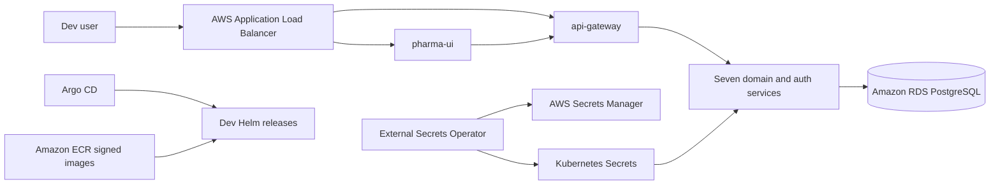

# Dev Deployment Record

## Deployment status

| Item | Result |
| --- | --- |
| Environment | `dev` only |
| EKS cluster | `pharma-dev-cluster` (`us-east-1`) |
| Kubernetes namespace | `dev` |
| Workloads | 9 of 9 Ready, zero restarts at validation |
| Argo CD | 9 of 9 applications Synced and Healthy |
| External Secrets | Secret store Ready; database and JWT secrets synced |
| Public entry point | `k8s-pharmadev-45007e77c4-1805765152.us-east-1.elb.amazonaws.com` |
| UI check | HTTP 200 |
| Auth health check | HTTP 200 at `/api/auth/health` |
| Service health | All eight backend `/actuator/health` checks passed |

Validated on 2026-09-12. No QA or production resources were deployed.

## Runtime design



The ALB uses one shared ingress group. `/api/*` has higher routing priority and
targets the API gateway; `/` targets the UI. Argo CD continuously reconciles the
dev definitions from the GitOps repository. AWS access for controllers uses IRSA,
so long-lived AWS keys are not stored in Kubernetes.

## Deployed images

| Workload | Immutable tag |
| --- | --- |
| api-gateway | `sha-b0f17f2` |
| auth-service | `sha-b0f17f2` |
| drug-catalog-service | `sha-b0f17f2` |
| inventory-service | `sha-b0f17f2` |
| manufacturing-service | `sha-b0f17f2` |
| qc-service | `sha-b0f17f2` |
| supplier-service | `sha-b0f17f2` |
| notification-service | `sha-71c1e3f` |
| pharma-ui | `sha-cf8d8ac` |

All images were scanned, pushed to ECR, and signed with Cosign before deployment.

## Platform components

| Component | Helm chart | Configuration |
| --- | --- | --- |
| Metrics Server | `3.14.0` | Two replicas; metrics API verified |
| AWS Load Balancer Controller | `3.5.0` | Two replicas; IRSA |
| External Secrets Operator | `2.10.0` | Two controller replicas; IRSA |
| Argo CD | `10.9.0` | Internal ClusterIP only |

Exact Helm values are stored under `kubernetes/dev/platform-values/`.

## Validation commands

Run these from Git Bash after configuring `kubectl` for the dev cluster:

```bash
kubectl get nodes
kubectl -n dev get pods
kubectl -n dev get ingress
kubectl -n dev get externalsecret
kubectl -n argocd get applications.argoproj.io
kubectl top nodes
```

Expected results are Ready nodes, nine Ready workload pods, two ingresses sharing
one ALB hostname, Ready external secrets, and nine Synced/Healthy Argo applications.

## Deployment notes

- The ALB controller policy required
  `elasticloadbalancing:SetRulePriorities` for the shared ingress group. Terraform
  applied this as an in-place IAM policy update with no resource replacement.
- The failed `admin / admin` login check correctly returned HTTP 403. The UI and
  database migration specify the dev-only seed login as `admin / changeme`.
- Replace the seed login before any environment is exposed beyond controlled dev
  testing. Do not put application passwords in Git, screenshots, or shell history.
- Current Flyway logs warn that this application version is tested through
  PostgreSQL 15 while RDS runs PostgreSQL 17.9. Migrations completed successfully,
  but upgrading Flyway is recommended before production.
- CI workflows currently report coverage but do not enforce the documented 80%
  threshold. Add enforced quality gates before promoting beyond dev.

## Rollback

Application rollback is GitOps-based: revert the image tag or values commit in the
GitOps repository and allow Argo CD to reconcile it. For urgent dev containment,
disable Argo auto-sync first, then scale the affected deployment to zero. Do not
apply these steps to QA or production as part of this dev deployment.
