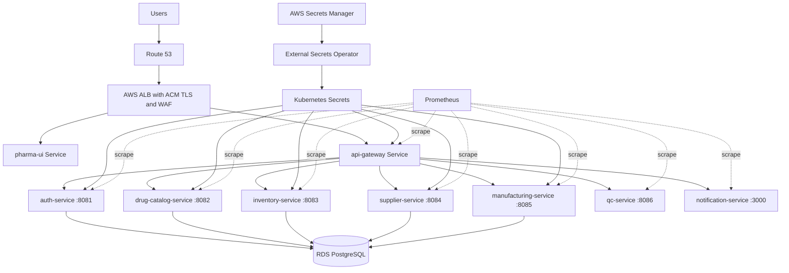
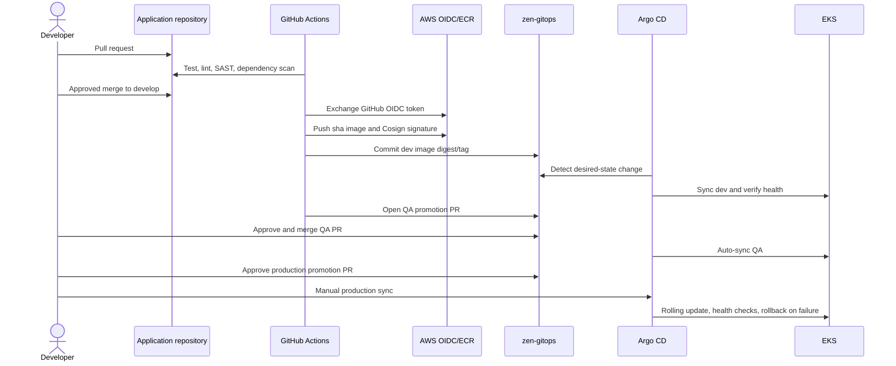

# Zen Pharma Kubernetes Deployment Design

**Document status:** Proposed for review  
**Deployment status:** **NO-GO** until the mandatory gates in this document pass  
**Scope:** `roland-zen-phama-backend`, `roland-zen-phama-frontend`, `Zen-Roland_infra`, `zen-gitops`, and `workflow-intro`  
**Platform:** AWS EKS, Amazon ECR, Amazon RDS for PostgreSQL, Argo CD, Helm, GitHub Actions

## 1. Executive decision

The application and CI repositories contain a strong starting point, and the dev Terraform has already been tested. The checked-in system is not ready to deploy as a company production platform yet. The release must remain blocked until secrets delivery, cluster add-ons, environment infrastructure, GitOps ownership, production controls, and validation are completed.

The approved target is:

- Terraform owns AWS infrastructure and cluster prerequisites.
- GitHub Actions tests, scans, signs, and publishes immutable images.
- GitHub Actions changes only image references in `zen-gitops`; it never applies to the cluster.
- Argo CD is the only application deployment actor.
- External Secrets Operator copies runtime secrets from AWS Secrets Manager into environment namespaces.
- Development auto-syncs. QA auto-syncs only after an approved promotion PR. Production requires an approved PR and a manual Argo CD sync.
- Each environment has its own namespace and secret path. Production must use independently provisioned production data services.

## 2. Current repository assessment

| Repository | Intended ownership | Current assessment |
|---|---|---|
| `roland-zen-phama-backend` | Seven Spring Boot services, one Node.js notification service, CI | Images, probes, ports, security scanning, signing, and GitOps tag updates exist. Runtime defaults contain development credentials and should fail closed outside local development. |
| `roland-zen-phama-frontend` | React/Nginx UI and CI | Build and delivery pipeline exist. Nginx proxies `/api` to the gateway. Runtime configuration is currently compiled into the image or unused ConfigMap values. |
| `Zen-Roland_infra` | AWS VPC, EKS, RDS, ECR, IAM, Secrets Manager | Dev infrastructure is present and reportedly tested. Only `envs/dev` exists. Cluster controllers and observability are not provisioned here. |
| `zen-gitops` | Desired cluster state, Helm values, Argo CD applications | Shared chart and per-service values exist, but cluster prerequisites advertised by the README are absent. QA/prod definitions are incomplete and contradictory. |
| `workflow-intro` | GitHub Actions training/example | Contains only a demo workflow. It is not part of the production delivery chain and must not be granted cloud or GitOps credentials. |

### Confirmed blockers

| ID | Severity | Finding | Required resolution |
|---|---|---|---|
| B-01 | Critical | `db-credentials` and `jwt-secret` are referenced by workloads, but no ExternalSecret resources or other supported creation flow exists. | Install External Secrets Operator with IRSA and define a store plus per-environment ExternalSecrets. Never commit Secret values. |
| B-02 | Critical | QA/prod values contain instructor account IDs, real-looking foreign RDS endpoints, dev endpoints, and `<RDS_ENDPOINT>` placeholders. | Generate environment values from approved Terraform outputs and AWS account configuration. Add policy checks rejecting placeholders and foreign account IDs. |
| B-03 | Critical | Only dev Terraform exists, while GitOps declares dev, QA, and prod. | Decide whether the first release is dev-only. Provision independent QA/prod infrastructure before enabling those Argo apps. |
| B-04 | Critical | `pharma-qa` and `pharma-prod` point to `envs/qa` and `envs/prod`, which contain values files rather than deployable manifests. | Remove these invalid umbrella Applications and use one consistent Application/ApplicationSet model referencing the Helm chart plus each values file. |
| B-05 | High | Production individual Applications enable automated pruning, and most enable self-heal, while documentation says production sync is manual. | Omit `automated` in prod. Retain retry and diff rules. Require protected-environment approval before manual sync. |
| B-06 | High | Production network policy expects `ingress-nginx`, but exposed workloads use `ingressClassName: alb`. | Model AWS Load Balancer Controller traffic correctly. Validate traffic before enforcing default-deny. |
| B-07 | High | No checked-in installation/configuration exists for AWS Load Balancer Controller, External Secrets Operator, Metrics Server, DNS/TLS, or monitoring. | Add pinned platform charts managed by Terraform or a dedicated Argo CD platform project, with IRSA and least privilege. |
| B-08 | High | QC exists only in dev GitOps. QA and prod have no QC values or Application. | Add QC consistently to all intended environments or explicitly remove its gateway route outside dev. |
| B-09 | High | Production gateway values omit inventory, supplier, manufacturing, and QC URL overrides. | Define every upstream explicitly and validate DNS/port mappings in CI. |
| B-10 | High | Production uses `targetRevision: HEAD`; chart and application changes are therefore not release-pinned. | Pin production to a protected branch/tag or commit policy. Pin third-party actions and Helm chart versions. |
| B-11 | Medium | Duplicate auth Applications (`auth-service.yml` and `auth-service-app.yaml`) exist in QA/prod. | Keep a single canonical resource per service/environment. |
| B-12 | Medium | `zen-gitops/README.md` describes non-existent `k8s/` resources and eight services although there are nine workloads including UI and QC. | Update documentation after the manifests are implemented and validated. |
| B-13 | Medium | The backend README swaps supplier/manufacturing port descriptions relative to the applications. | Correct the inventory: supplier is 8084 and manufacturing is 8085. |
| B-14 | Medium | The frontend image creates a user but does not switch to it; upstream Nginx commonly starts as root. | Use a tested unprivileged Nginx image/config or explicitly harden and verify its runtime UID. |
| B-15 | Medium | Java services permit local default DB credentials and auth permits a default JWT secret. | Use a `local` profile for defaults. Production-like profiles must require injected values and fail startup when absent. |

## 3. Target architecture



### Delivery and trust flow



### Environment boundaries

| Control | Dev | QA | Production |
|---|---|---|---|
| Namespace | `pharma-dev` | `pharma-qa` | `pharma-prod` |
| Sync | Automatic + self-heal | Automatic after approved PR | Manual after approved PR |
| Minimum replicas | 1 | 2 for critical edge services | 2 or more, HPA managed |
| Database | Dedicated dev | Dedicated QA | Dedicated Multi-AZ production |
| Secret path | `/pharma/dev/*` | `/pharma/qa/*` | `/pharma/prod/*` |
| Public entry | Optional restricted | Restricted | ALB + TLS + WAF |
| Logs/metrics retention | Short | Medium | Compliance-approved |
| Destructive migrations | Allowed only with disposable data | Approval required | Prohibited in app startup |

## 4. Workload contract

| Workload | Port | Exposure | Database schema | Required secrets |
|---|---:|---|---|---|
| `pharma-ui` | 80 | ALB `/` | None | None |
| `api-gateway` | 8080 | ALB `/api` | None | JWT verification secret if symmetric JWT remains |
| `auth-service` | 8081 | Gateway only | `auth` | DB credentials, JWT signing secret |
| `drug-catalog-service` | 8082 | Gateway only | `drug_catalog` | DB credentials |
| `inventory-service` | 8083 | Gateway only | `inventory` | DB credentials |
| `supplier-service` | 8084 | Gateway only | `procurement` | DB credentials |
| `manufacturing-service` | 8085 | Gateway only | `manufacturing` | DB credentials |
| `qc-service` | 8086 | Gateway only | Current implementation is in-memory | None currently |
| `notification-service` | 3000 | Gateway only | None in current code | SMTP/provider credentials when real delivery is enabled |

All services must expose distinct startup, readiness, and liveness semantics. Readiness may include mandatory dependencies; liveness must not restart a healthy process merely because RDS is temporarily unavailable. A startup probe should protect slow Spring/Flyway initialization.

## 5. GitOps repository design

The GitOps repository should become the single application desired-state source:

```text
zen-gitops/
|-- charts/pharma-service/
|-- platform/
|   |-- namespaces/
|   |-- external-secrets/
|   |-- network-policies/
|   `-- observability/
|-- environments/
|   |-- dev/values-*.yaml
|   |-- qa/values-*.yaml
|   `-- prod/values-*.yaml
|-- argocd/
|   |-- projects/
|   `-- applicationsets/
|-- policies/
`-- tests/
```

Required Helm chart capabilities:

- Deployment strategy, revision history, progress deadline, and graceful shutdown.
- Optional startup/readiness/liveness probes.
- Pod Security Standards compatible container and pod contexts.
- ConfigMap checksums and Secret checksums where appropriate.
- HPA v2, PDB, topology spread, and anti-affinity.
- ServiceMonitor/PodMonitor support.
- NetworkPolicy with explicit caller selectors, DNS egress, RDS egress, and provider egress.
- Optional Ingress supporting ALB annotations, TLS, health-check path, and group behavior.
- Schema validation through `values.schema.json`.
- No secret values in values files.

## 6. Security baseline

- Use GitHub OIDC for AWS. Do not store AWS access keys.
- Give CI push access only to its ECR repositories. CI receives no Kubernetes credentials.
- Give External Secrets Operator read access only to `/pharma/<environment>/*`.
- Separate workload service accounts from controller service accounts. Do not attach the EKS cluster role to application pods.
- Run as non-root, drop Linux capabilities, disallow privilege escalation, use seccomp `RuntimeDefault`, and keep the root filesystem read-only where the image supports it.
- Encrypt RDS, EBS, Secrets Manager, and Kubernetes secrets with customer-managed KMS keys where company policy requires it.
- Use immutable ECR tags or deploy by digest. Retain signed release images long enough to support rollback and audit; keeping only ten images is insufficient without a release exemption.
- Enforce protected branches, CODEOWNERS, required checks, signed commits if required, and GitHub environments for QA/prod.
- Pin GitHub Actions by full commit SHA and periodically update them through controlled dependency automation.
- Add admission policies for trusted registries, required resources/probes, non-root execution, approved Ingress classes, and no `latest` tags.
- Do not expose Argo CD publicly without SSO, TLS, RBAC, and network restrictions.

## 7. Reliability and operations

### Service-level objectives

Initial objectives must be confirmed by the product owner. A reasonable starting proposal is 99.9% monthly availability for UI/gateway and 99.5% for internal services, with p95 API latency below 500 ms excluding batch operations.

### Required telemetry

- Structured JSON logs with timestamp, service, environment, trace ID, request ID, route, status, and latency. Never log JWTs, passwords, or patient/customer data.
- Prometheus request, JVM/Node, pod, deployment, ingress, and RDS metrics.
- Distributed tracing through OpenTelemetry with trace context propagated by the gateway.
- Alerts for availability, error-budget burn, elevated 5xx, latency, crash loops, failed Argo syncs, certificate expiry, RDS storage/connections, and unschedulable pods.
- Dashboards for platform health, release health, application golden signals, and database capacity.

### Release and rollback

1. Run preflight policy, Helm render, schema, and image-signature checks.
2. Snapshot/verify RDS backup status before a production schema migration.
3. Sync one release wave: secrets/config, backend dependencies, gateway, then UI.
4. Require readiness success and an automated smoke test before continuing.
5. Roll back Git desired state to the last known image digest if health gates fail.
6. Database migrations must be backward compatible. Rollback cannot depend on reversing a destructive migration.

## 8. Implementation plan and approval gates

| Phase | Change set | Evidence required | Gate |
|---|---|---|---|
| 0 | Approve this design and initial environment scope | Named owners, AWS account IDs, domains, SLOs | Architecture approval |
| 1 | Correct application runtime configuration and frontend/container hardening | Unit tests, image build, local health tests | Application approval |
| 2 | Add required EKS controllers and IAM roles | Terraform plan, controller health, least-privilege review | Platform approval |
| 3 | Rebuild GitOps structure, secrets, namespaces, policies, and all nine workloads | Helm lint/render, kubeconform, policy tests | GitOps approval |
| 4 | Deploy dev only | Smoke, integration, security, restart, and rollback tests | Dev acceptance |
| 5 | Provision and deploy QA | End-to-end, load, DAST, backup/restore test | Release approval |
| 6 | Provision production | DR review, change ticket, on-call/runbook confirmation | Production readiness review |
| 7 | Production release | Approved PR plus manual sync and observation window | Change manager approval |

## 9. Pre-deployment commands

These commands are validation examples; they do not authorize a deployment.

```bash
terraform -chdir=envs/dev fmt -check -recursive
terraform -chdir=envs/dev validate
terraform -chdir=envs/dev plan -out=tfplan

helm lint charts/pharma-service
helm template auth-service charts/pharma-service \
  --namespace pharma-dev \
  -f environments/dev/values-auth-service.yaml > rendered.yaml
kubeconform -strict -summary rendered.yaml

kubectl apply --dry-run=server -f rendered.yaml
conftest test rendered.yaml --policy policies
```

Before any real cluster command, capture the active AWS identity, cluster, context, namespace, Git commit, image digest, approver, and rollback revision in the change record.

## 10. Explicit deployment hold points

No deployment may begin until all of the following are true:

- The exact first target is approved. With the current Terraform, only dev is eligible.
- The GitOps changes are implemented and pass render/schema/policy validation.
- All images exist in the correct ECR account and their signatures verify.
- External Secrets has produced required Secrets without storing plaintext in Git.
- ALB Controller, Metrics Server, DNS/TLS, and observability are healthy.
- Network policies pass positive and negative connectivity tests.
- RDS schemas, Flyway ownership, backup, restore, and migration rollback strategy are approved.
- No placeholder, instructor account ID, foreign endpoint, `latest`, or floating production revision remains.
- Smoke and rollback tests have passed in dev.
- Production deployment has a change record, approver, on-call owner, and observation window.

## 11. Approval record

| Role | Name | Decision | Date | Notes |
|---|---|---|---|---|
| Product owner |  |  |  |  |
| Application owner |  |  |  |  |
| Platform owner |  |  |  |  |
| Security reviewer |  |  |  |  |
| Database owner |  |  |  |  |
| Change manager |  |  |  |  |

